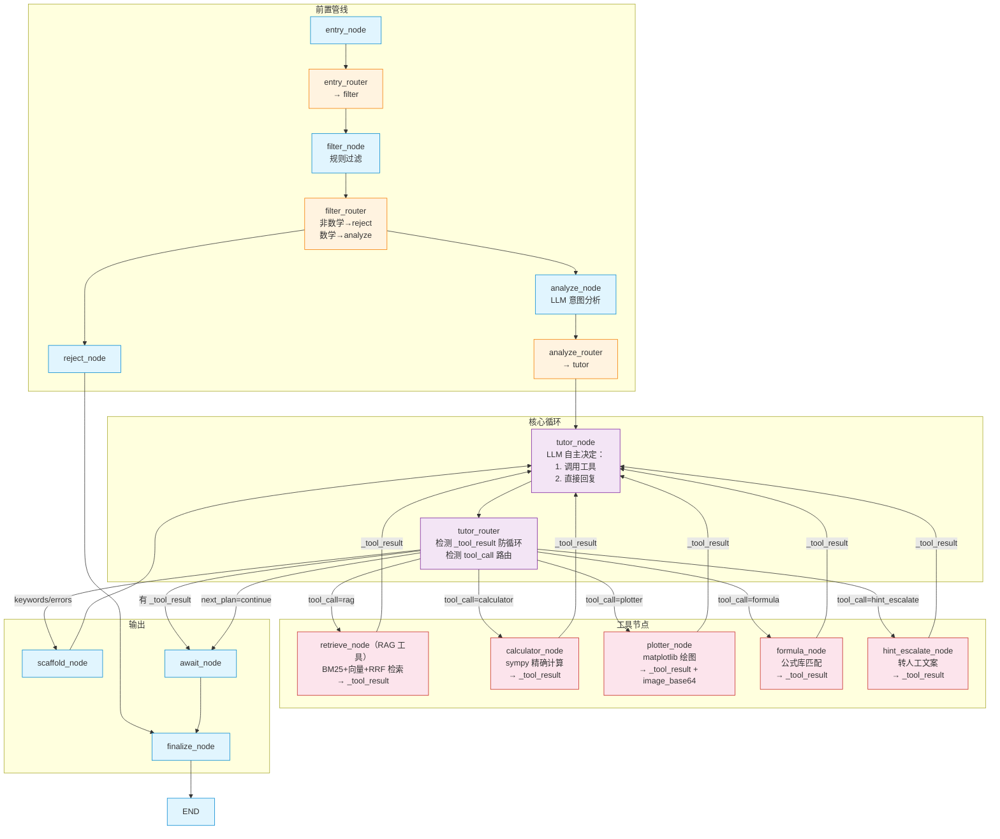

# 学途 AI Agent — 循环工具调用架构

```mermaid
flowchart TB
    subgraph 前置管线
        ENTRY["entry_node"]
        ENTRY_ROUTER["entry_router<br/>→ filter"]
        FILTER["filter_node<br/>规则过滤"]
        FILTER_ROUTER["filter_router<br/>非数学→reject<br/>数学→analyze"]
        REJECT["reject_node"]
        ANALYZE["analyze_node<br/>LLM 意图分析"]
        ANALYZE_ROUTER["analyze_router<br/>→ tutor"]
    end

    subgraph 核心循环
        TUTOR["tutor_node<br/>LLM 自主决定：<br/>1. 调用工具<br/>2. 直接回复"]
        TUTOR_ROUTER["tutor_router<br/>检测 _tool_result 防循环<br/>检测 tool_call 路由"]
    end

    subgraph 工具节点
        RAG["retrieve_node（RAG 工具）<br/>BM25+向量+RRF 检索<br/>→ _tool_result"]
        CALC["calculator_node<br/>sympy 精确计算<br/>→ _tool_result"]
        PLOT["plotter_node<br/>matplotlib 绘图<br/>→ _tool_result + image_base64"]
        FORMULA["formula_node<br/>公式库匹配<br/>→ _tool_result"]
        ESCALATE["hint_escalate_node<br/>转人工文案<br/>→ _tool_result"]
    end

    subgraph 输出
        SCAFFOLD["scaffold_node"]
        AWAIT["await_node"]
        FINALIZE["finalize_node"]
    end

    ENTRY --> ENTRY_ROUTER --> FILTER
    FILTER --> FILTER_ROUTER
    FILTER_ROUTER --> REJECT
    FILTER_ROUTER --> ANALYZE
    REJECT --> FINALIZE
    ANALYZE --> ANALYZE_ROUTER
    ANALYZE_ROUTER --> TUTOR

    TUTOR --> TUTOR_ROUTER

    TUTOR_ROUTER -->|tool_call=rag| RAG
    TUTOR_ROUTER -->|tool_call=calculator| CALC
    TUTOR_ROUTER -->|tool_call=plotter| PLOT
    TUTOR_ROUTER -->|tool_call=formula| FORMULA
    TUTOR_ROUTER -->|tool_call=hint_escalate| ESCALATE
    TUTOR_ROUTER -->|有 _tool_result| AWAIT
    TUTOR_ROUTER -->|keywords/errors| SCAFFOLD
    TUTOR_ROUTER -->|next_plan=continue| AWAIT

    RAG -->|_tool_result| TUTOR
    CALC -->|_tool_result| TUTOR
    PLOT -->|_tool_result| TUTOR
    FORMULA -->|_tool_result| TUTOR
    ESCALATE -->|_tool_result| TUTOR
    SCAFFOLD --> TUTOR

    AWAIT --> FINALIZE
    FINALIZE --> END

    classDef node fill:#e1f5fe,stroke:#0288d1
    classDef router fill:#fff3e0,stroke:#f57c00
    classDef tool fill:#fce4ec,stroke:#c62828
    classDef loop fill:#f3e5f5,stroke:#7b1fa2

    class ENTRY,FILTER,ANALYZE,TUTOR,SCAFFOLD,REJECT,AWAIT,FINALIZE node
    class ENTRY_ROUTER,FILTER_ROUTER,ANALYZE_ROUTER,TUTOR_ROUTER router
    class RAG,CALC,PLOT,FORMULA,ESCALATE tool
    class TUTOR,TUTOR_ROUTER loop
```
